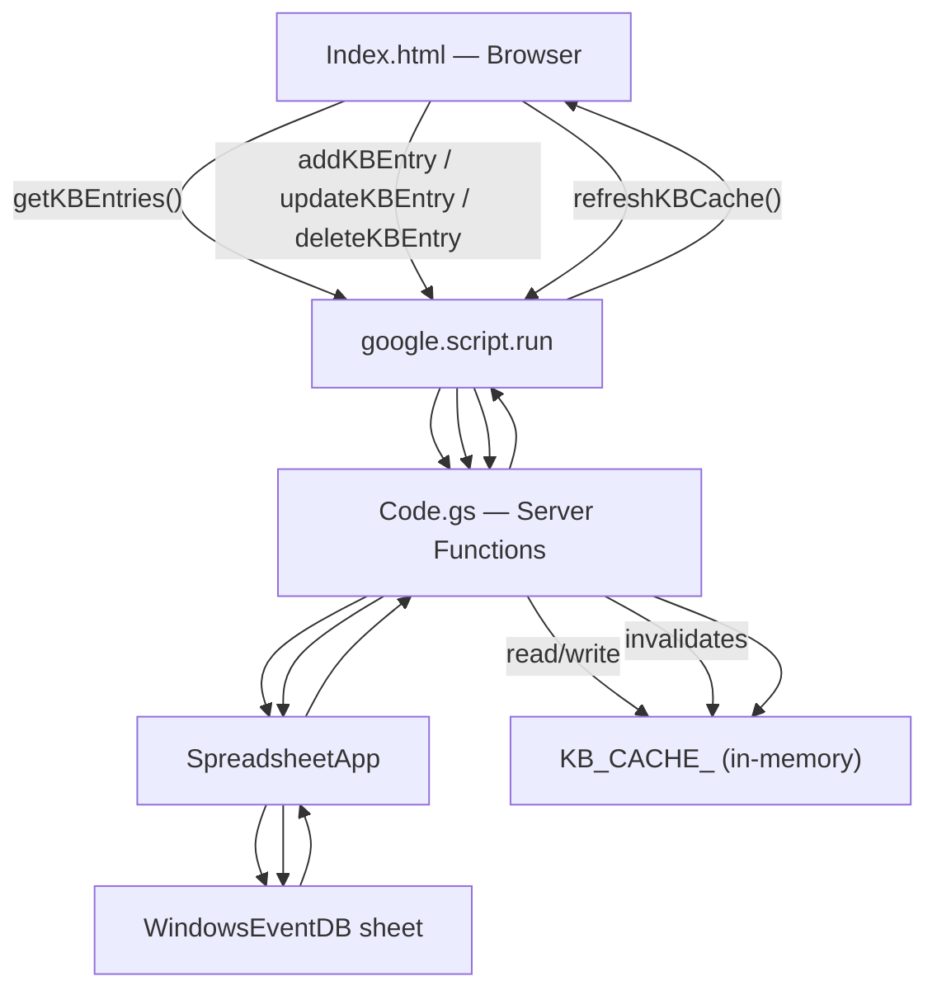
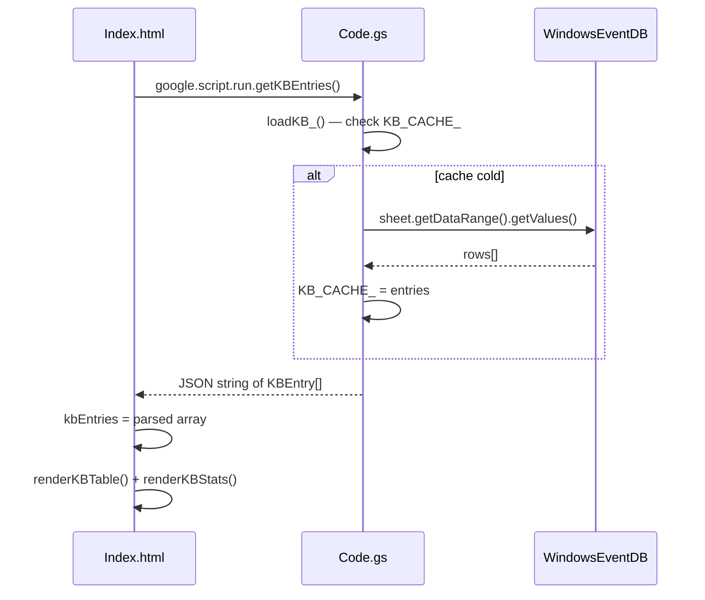
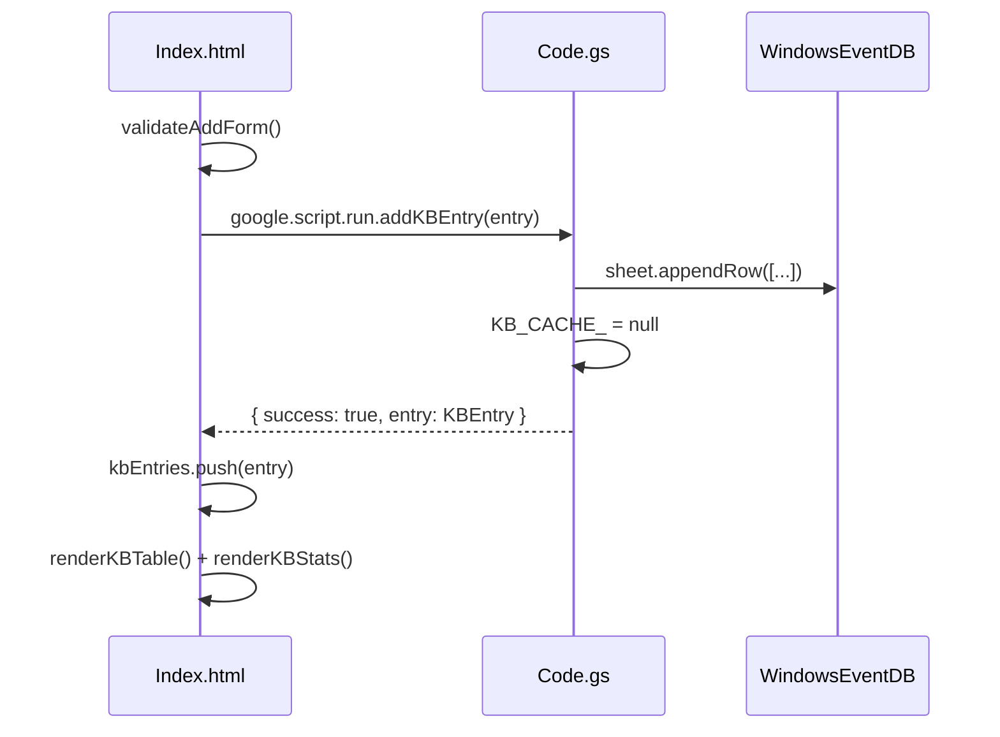
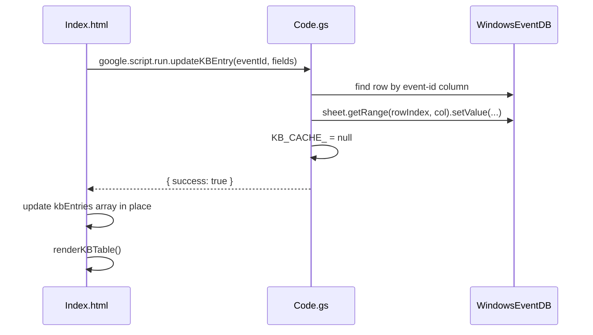
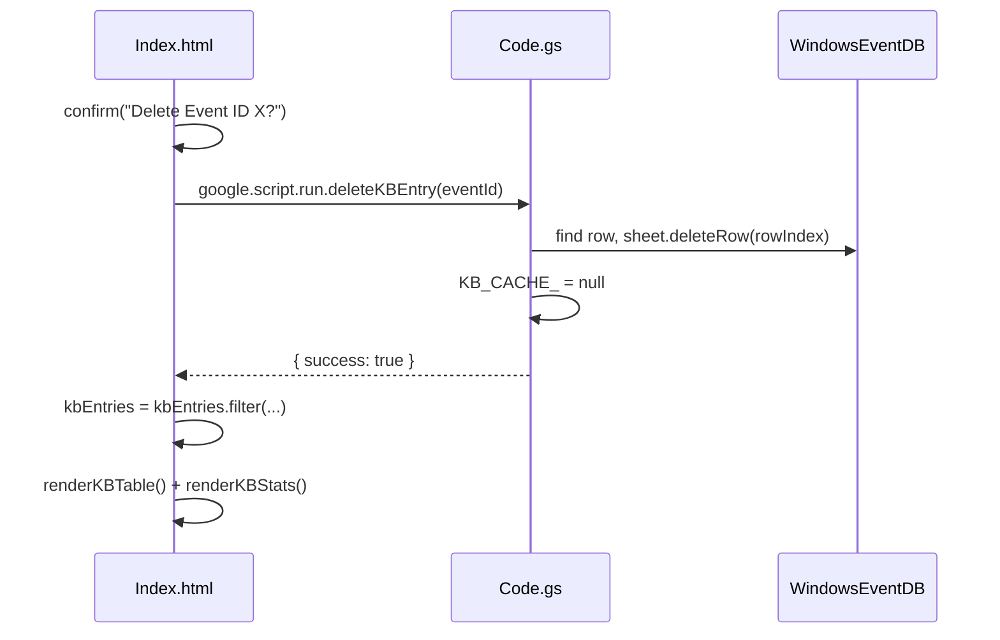
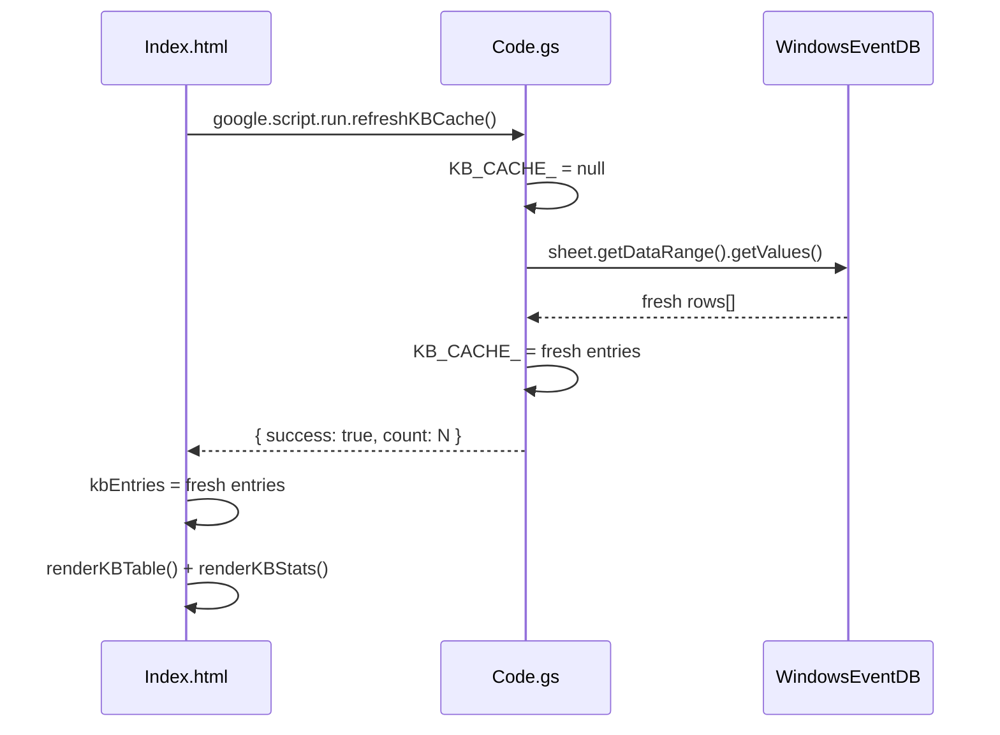

# Design Document: appscript-kb-summary

## Overview

This feature adds a **KB Summary** tab to the Event Viewer Analyzer Google Apps Script web app, exposing full CRUD management of the `WindowsEventDB` Knowledge Base sheet directly in the browser. Users can view, search, filter, add, edit, and delete KB entries, force-refresh the server cache, and export the KB — all without leaving the single-page app hosted by GAS.

The feature extends `Code.gs` with five new server-side functions and adds a new `tab-kb` section to `Index.html`, following the exact same patterns (tab switching, `google.script.run`, badge conventions, CSS variables) already established in the codebase.

---

## Architecture



All writes go through `SpreadsheetApp.openById(sheetId)`, identical to the existing `loadKB_()`, `logAnalysisHistory()`, and `getServerHistory()` patterns. Cache `KB_CACHE_` is set to `null` after every write so the next read triggers a fresh sheet load.

---

## Sequence Diagrams

### Load KB Tab



### Add Entry



### Update Entry



### Delete Entry



### Force Refresh Cache



---

## Components and Interfaces

### Server-Side: `Code.gs` additions

**Purpose**: Expose CRUD operations on `WindowsEventDB` sheet to the browser via `google.script.run`.

**Interface**:

```javascript
// Returns JSON string of KBEntry[]
function getKBEntries()

// Returns JSON string of { success: boolean, entry?: KBEntry, error?: string }
function addKBEntry(entryJson)

// Returns JSON string of { success: boolean, error?: string }
function updateKBEntry(eventId, fieldsJson)

// Returns JSON string of { success: boolean, error?: string }
function deleteKBEntry(eventId)

// Returns JSON string of { success: boolean, count: number, error?: string }
function refreshKBCache()
```

**Responsibilities**:
- Resolve `KB_SHEET_ID` from `PropertiesService` (same as `loadKB_()`)
- Validate inputs before any sheet write
- Invalidate `KB_CACHE_` after every write
- Return structured JSON responses for uniform client error handling

---

### Client-Side: KB Tab in `Index.html`

**Purpose**: Render the KB Summary page and manage local state for instant UI updates without redundant server calls.

**Interface (JS state & functions)**:

```javascript
var kbEntries = [];          // in-memory copy of all KB rows
var kbFiltered = [];         // post-filter view

function loadKBTab()          // called when tab becomes active (once)
function renderKBStats()      // update stats cards
function renderKBTable()      // re-render table from kbFiltered
function applyKBFilters()     // text search + criticality filter → kbFiltered
function openAddForm()        // show inline add-entry form
function submitAddEntry()     // validate + call google.script.run.addKBEntry
function openEditModal(eventId) // populate edit modal
function submitEditEntry()    // call google.script.run.updateKBEntry
function deleteEntry(eventId) // confirm + call google.script.run.deleteKBEntry
function syncKBCache()        // call google.script.run.refreshKBCache
function exportKB(format)     // 'json' or 'csv' — client-side download
```

**Responsibilities**:
- Maintain `kbEntries` as the single source of truth for the KB tab
- Apply mutations locally after server confirms success (optimistic-ish pattern)
- Drive the stats bar from `kbEntries` (no extra server call)
- Export purely client-side from `kbEntries`

---

## Data Models

### `KBEntry`

```javascript
{
  "event-id":        string,   // required, numeric string e.g. "4625"
  "legacy-event-id": string,   // optional, can be ""
  "criticality":     string,   // one of: "Critical" | "High" | "Medium" | "Low" | "Unknown"
  "summary":         string    // required, human-readable description
}
```

**Validation Rules**:
- `event-id` must be a non-empty string containing only digits
- `criticality` must be one of the five allowed values
- `summary` must be non-empty with a maximum of 500 characters
- Duplicate `event-id` on add is rejected by the server

### `KBStats`

Derived client-side from `kbEntries`:

```javascript
{
  total:    number,
  critical: number,
  high:     number,
  medium:   number,
  low:      number,
  unknown:  number
}
```

---

## Key Functions with Formal Specifications

### `getKBEntries()`

```javascript
function getKBEntries()
// Returns: JSON string of KBEntry[]
```

**Preconditions:**
- `KB_SHEET_ID` is set in `PropertiesService` or resolvable via `loadKB_()`
- Caller is an authenticated GAS web app user

**Postconditions:**
- Returns a JSON string; parsing it yields an array of `KBEntry` objects (may be empty `[]`)
- Does not mutate `KB_CACHE_` if already warm
- Never throws; any error returns `"[]"` and logs to `Logger`

---

### `addKBEntry(entryJson)`

```javascript
function addKBEntry(entryJson)
// entryJson: JSON string of KBEntry
// Returns: JSON string of { success: boolean, entry?: KBEntry, error?: string }
```

**Preconditions:**
- `entryJson` is valid JSON matching the `KBEntry` shape
- `entry["event-id"]` is non-empty and contains only digits
- `entry["criticality"]` is one of the five allowed values
- `entry["summary"]` is non-empty

**Postconditions:**
- If preconditions hold: row appended to sheet, `KB_CACHE_` set to `null`, returns `{ success: true, entry: KBEntry }`
- If duplicate `event-id`: returns `{ success: false, error: "Duplicate event-id: X" }`, sheet unchanged
- If any precondition fails: returns `{ success: false, error: "..." }`, sheet unchanged

**Loop Invariants:** N/A (no loops)

---

### `updateKBEntry(eventId, fieldsJson)`

```javascript
function updateKBEntry(eventId, fieldsJson)
// eventId: string (the event-id to update)
// fieldsJson: JSON string of { criticality?: string, summary?: string, "legacy-event-id"?: string }
// Returns: JSON string of { success: boolean, error?: string }
```

**Preconditions:**
- `eventId` is a non-empty string
- `fieldsJson` parses to an object with at least one valid updatable field
- A row with `event-id === eventId` exists in the sheet

**Postconditions:**
- Matching row's updatable columns are overwritten in the sheet
- `KB_CACHE_` set to `null`
- Returns `{ success: true }` on success
- If row not found: returns `{ success: false, error: "Entry not found: X" }`, sheet unchanged

**Loop Invariants:**
- Row scan loop: all rows examined before target row remain unmodified

---

### `deleteKBEntry(eventId)`

```javascript
function deleteKBEntry(eventId)
// eventId: string
// Returns: JSON string of { success: boolean, error?: string }
```

**Preconditions:**
- `eventId` is a non-empty string
- A row with `event-id === eventId` exists in the sheet

**Postconditions:**
- Matching row is permanently deleted from sheet (`sheet.deleteRow(rowIndex)`)
- `KB_CACHE_` set to `null`
- Returns `{ success: true }` on success
- If row not found: returns `{ success: false, error: "Entry not found: X" }`

---

### `refreshKBCache()`

```javascript
function refreshKBCache()
// Returns: JSON string of { success: boolean, count: number, error?: string }
```

**Preconditions:**
- Sheet is accessible

**Postconditions:**
- `KB_CACHE_` is set to `null` then immediately re-populated by calling `loadKB_()`
- Returns `{ success: true, count: N }` where `N` is the new entry count
- The in-memory cache is warm after this call (no cold cache on next access)

---

## Algorithmic Pseudocode

### `addKBEntry` Algorithm

```pascal
ALGORITHM addKBEntry(entryJson)
INPUT: entryJson — JSON string
OUTPUT: result — JSON string

BEGIN
  TRY
    entry ← JSON.parse(entryJson)

    // Validate
    IF entry["event-id"] is empty OR not all-digits THEN
      RETURN JSON.stringify({ success: false, error: "Invalid event-id" })
    END IF
    IF entry["criticality"] NOT IN ["Critical","High","Medium","Low","Unknown"] THEN
      RETURN JSON.stringify({ success: false, error: "Invalid criticality" })
    END IF
    IF entry["summary"] is empty THEN
      RETURN JSON.stringify({ success: false, error: "Summary required" })
    END IF

    // Duplicate check
    existing ← loadKB_()
    FOR each e IN existing DO
      IF e["event-id"] = entry["event-id"] THEN
        RETURN JSON.stringify({ success: false, error: "Duplicate event-id: " + entry["event-id"] })
      END IF
    END FOR

    // Write to sheet
    sheetId ← PropertiesService.getScriptProperties().getProperty("KB_SHEET_ID")
    sheet ← SpreadsheetApp.openById(sheetId).getSheetByName("WindowsEventDB")
    sheet.appendRow([entry["event-id"], entry["legacy-event-id"], entry["criticality"], entry["summary"]])

    // Invalidate cache
    KB_CACHE_ ← null

    RETURN JSON.stringify({ success: true, entry: entry })
  CATCH e
    RETURN JSON.stringify({ success: false, error: e.toString() })
  END TRY
END
```

**Loop Invariants:**
- Duplicate-check loop: all entries at indices < i have `event-id` ≠ `entry["event-id"]` when loop continues

---

### `updateKBEntry` Algorithm

```pascal
ALGORITHM updateKBEntry(eventId, fieldsJson)
INPUT: eventId — string, fieldsJson — JSON string
OUTPUT: result — JSON string

BEGIN
  TRY
    fields ← JSON.parse(fieldsJson)
    sheetId ← PropertiesService.getScriptProperties().getProperty("KB_SHEET_ID")
    sheet ← SpreadsheetApp.openById(sheetId).getSheetByName("WindowsEventDB")
    data ← sheet.getDataRange().getValues()
    headers ← data[0]          // ["event-id","legacy-event-id","criticality","summary"]

    rowIndex ← -1
    FOR i FROM 1 TO data.length - 1 DO
      // Invariant: no row in [1..i-1] has event-id = eventId
      IF data[i][0] = eventId THEN
        rowIndex ← i + 1       // 1-indexed for GAS sheet API
        BREAK
      END IF
    END FOR

    IF rowIndex = -1 THEN
      RETURN JSON.stringify({ success: false, error: "Entry not found: " + eventId })
    END IF

    // Apply field updates
    FOR each key IN fields DO
      colIndex ← indexOf(headers, key) + 1   // 1-indexed
      IF colIndex > 0 THEN
        sheet.getRange(rowIndex, colIndex).setValue(fields[key])
      END IF
    END FOR

    KB_CACHE_ ← null
    RETURN JSON.stringify({ success: true })
  CATCH e
    RETURN JSON.stringify({ success: false, error: e.toString() })
  END TRY
END
```

---

### `deleteKBEntry` Algorithm

```pascal
ALGORITHM deleteKBEntry(eventId)
INPUT: eventId — string
OUTPUT: result — JSON string

BEGIN
  TRY
    sheetId ← PropertiesService.getScriptProperties().getProperty("KB_SHEET_ID")
    sheet ← SpreadsheetApp.openById(sheetId).getSheetByName("WindowsEventDB")
    data ← sheet.getDataRange().getValues()

    rowIndex ← -1
    FOR i FROM 1 TO data.length - 1 DO
      IF data[i][0] = eventId THEN
        rowIndex ← i + 1
        BREAK
      END IF
    END FOR

    IF rowIndex = -1 THEN
      RETURN JSON.stringify({ success: false, error: "Entry not found: " + eventId })
    END IF

    sheet.deleteRow(rowIndex)
    KB_CACHE_ ← null
    RETURN JSON.stringify({ success: true })
  CATCH e
    RETURN JSON.stringify({ success: false, error: e.toString() })
  END TRY
END
```

---

### Client-Side: `applyKBFilters` Algorithm

```pascal
ALGORITHM applyKBFilters()
INPUT: kbEntries[] (global), searchInput.value, critFilter.value
OUTPUT: kbFiltered[] (mutated global)

BEGIN
  query   ← searchInput.value.toLowerCase().trim()
  critVal ← critFilter.value   // "All" | "Critical" | "High" | ...

  kbFiltered ← []

  FOR each entry IN kbEntries DO
    // Text match
    textMatch ← (query = "") OR
                 entry["event-id"].indexOf(query) ≥ 0 OR
                 entry["summary"].toLowerCase().indexOf(query) ≥ 0

    // Criticality match
    critMatch ← (critVal = "All") OR (entry["criticality"] = critVal)

    IF textMatch AND critMatch THEN
      kbFiltered.push(entry)
    END IF
  END FOR

  renderKBTable()
  renderKBStats()   // stats reflect unfiltered kbEntries (total KB, not filtered view)
END
```

**Loop Invariants:**
- All entries at index < i that satisfy both predicates are already in `kbFiltered`

---

### Client-Side: `exportKB` Algorithm

```pascal
ALGORITHM exportKB(format)
INPUT: format — "json" | "csv", kbEntries[] (global)
OUTPUT: browser file download

BEGIN
  IF format = "json" THEN
    content  ← JSON.stringify(kbEntries, null, 2)
    mimeType ← "application/json"
    fileName ← "kb-export.json"

  ELSE IF format = "csv" THEN
    header  ← "event-id,legacy-event-id,criticality,summary"
    rows    ← []
    FOR each entry IN kbEntries DO
      row ← csvEscape(entry["event-id"])  + "," +
             csvEscape(entry["legacy-event-id"]) + "," +
             csvEscape(entry["criticality"]) + "," +
             csvEscape(entry["summary"])
      rows.push(row)
    END FOR
    content  ← header + "\n" + rows.join("\n")
    mimeType ← "text/csv"
    fileName ← "kb-export.csv"
  END IF

  blob ← new Blob([content], { type: mimeType })
  url  ← URL.createObjectURL(blob)
  a    ← document.createElement("a")
  a.href     ← url
  a.download ← fileName
  a.click()
  URL.revokeObjectURL(url)
END
```

---

## Example Usage

### Server-Side (called from browser via `google.script.run`)

```javascript
// Read all entries
google.script.run
  .withSuccessHandler(function(json) {
    kbEntries = JSON.parse(json);
    renderKBTable();
    renderKBStats();
  })
  .getKBEntries();

// Add a new entry
var newEntry = {
  "event-id": "4663",
  "legacy-event-id": "",
  "criticality": "Medium",
  "summary": "An attempt was made to access an object"
};
google.script.run
  .withSuccessHandler(function(json) {
    var result = JSON.parse(json);
    if (result.success) {
      kbEntries.push(result.entry);
      renderKBTable();
      renderKBStats();
    } else {
      showKBError(result.error);
    }
  })
  .addKBEntry(JSON.stringify(newEntry));

// Update criticality only
google.script.run
  .withSuccessHandler(function(json) {
    var result = JSON.parse(json);
    if (result.success) {
      // patch local state
      var idx = kbEntries.findIndex(function(e) { return e["event-id"] === "4663"; });
      if (idx !== -1) kbEntries[idx]["criticality"] = "High";
      renderKBTable();
    }
  })
  .updateKBEntry("4663", JSON.stringify({ "criticality": "High" }));

// Delete an entry
google.script.run
  .withSuccessHandler(function(json) {
    var result = JSON.parse(json);
    if (result.success) {
      kbEntries = kbEntries.filter(function(e) { return e["event-id"] !== "4663"; });
      renderKBTable();
      renderKBStats();
    }
  })
  .deleteKBEntry("4663");

// Force sync cache
google.script.run
  .withSuccessHandler(function(json) {
    var result = JSON.parse(json);
    if (result.success) {
      // re-load client state
      loadKBTab();
    }
  })
  .refreshKBCache();
```

---

## Correctness Properties

### Property 1: Cache Consistency After Write

**Validates: Requirements 1.7** (Force refresh KB cache — all writes must invalidate the server cache so the next read reflects the latest sheet state)

For every successful write operation (`addKBEntry`, `updateKBEntry`, `deleteKBEntry`, `refreshKBCache`), `KB_CACHE_` must be `null` immediately after the function returns, guaranteeing the next `loadKB_()` call reads fresh data from the sheet.

```javascript
// After any write function succeeds, cache must be invalidated
assert(KB_CACHE_ === null, "Cache must be null after write");
```

### Property 2: No Duplicate Event IDs

**Validates: Requirements 1.3** (Add new KB entries — the system must prevent adding an entry with an event-id that already exists in the sheet)

After any `addKBEntry` call returns `{ success: true }`, no two rows in `WindowsEventDB` share the same `event-id` value.

```javascript
// For all eventId x: count of rows with event-id === x must equal 1
var entries = JSON.parse(getKBEntries());
var ids = entries.map(function(e) { return e["event-id"]; });
assert(ids.length === new Set(ids).size, "All event-ids must be unique");
```

### Property 3: Idempotent Delete

**Validates: Requirements 1.5** (Delete entries — attempting to delete a non-existent entry must fail gracefully without modifying the sheet)

Calling `deleteKBEntry(eventId)` on an already-deleted (non-existent) entry returns `{ success: false, error: "Entry not found: ..." }` and does not modify the sheet.

```javascript
// Deleting a non-existent ID must not reduce row count
var beforeCount = JSON.parse(getKBEntries()).length;
deleteKBEntry("99999-nonexistent");
var afterCount = JSON.parse(getKBEntries()).length;
assert(beforeCount === afterCount, "Sheet unchanged after delete of missing entry");
```

### Property 4: Stats Accuracy

**Validates: Requirements 1.2** (View KB statistics — stats cards must always reflect the true total entry count regardless of active search filters)

`renderKBStats()` always computes counts from the full `kbEntries` array (not `kbFiltered`), so applying any search filter never changes the displayed total entry count.

```javascript
// stats.total must always equal kbEntries.length regardless of active filters
assert(computeStats(kbEntries).total === kbEntries.length, "Stats total matches full array length");
assert(computeStats(kbEntries).critical + computeStats(kbEntries).high +
       computeStats(kbEntries).medium  + computeStats(kbEntries).low  +
       computeStats(kbEntries).unknown === computeStats(kbEntries).total, "Criticality counts sum to total");
```

### Property 5: Export Completeness

**Validates: Requirements 1.8** (Export KB — the exported file must contain all KB entries without omission or duplication)

The exported CSV from `exportKB('csv')` contains exactly `kbEntries.length + 1` lines (one header row plus one row per entry); the JSON export contains exactly `kbEntries.length` objects.

```javascript
// CSV line count (excluding trailing newline) === kbEntries.length + 1
var csvLines = exportedCSV.trim().split("\n");
assert(csvLines.length === kbEntries.length + 1, "CSV row count matches entries plus header");
// JSON array length === kbEntries.length
assert(JSON.parse(exportedJSON).length === kbEntries.length, "JSON array length matches entries");
```

### Property 6: Filter Is a Subset

**Validates: Requirements 1.6** (Search/filter — filtered results must always be a subset of the full KB entries, never introducing or losing entries relative to the source array)

After applying any combination of search text and criticality filter, the resulting `kbFiltered` array is always a subset of `kbEntries`.

```javascript
// For all queries q and criticality c: applyKBFilters(q, c).length <= kbEntries.length
assert(kbFiltered.length <= kbEntries.length, "Filtered view never exceeds full entry list");
// Every entry in kbFiltered must also exist in kbEntries
kbFiltered.forEach(function(e) {
  assert(kbEntries.some(function(k) { return k["event-id"] === e["event-id"]; }),
    "Every filtered entry must be present in the source array");
});
```

---

## Error Handling

### Scenario 1: Sheet Not Accessible

**Condition**: `PropertiesService` has no `KB_SHEET_ID`, or the sheet has been deleted/moved.
**Response**: Server function catches the `SpreadsheetApp` exception and returns `{ success: false, error: "KB sheet not found. Please reinitialize." }`.
**Recovery**: Client shows an inline error banner above the KB table with a "Reinitialize KB" button that triggers a full page reload and GAS `createKBSheet_()` fallback.

### Scenario 2: Duplicate Event ID on Add

**Condition**: User submits an Event ID that already exists in `kbEntries`.
**Response**: Caught client-side first (instant feedback before server call). Server performs a second guard check; returns `{ success: false, error: "Duplicate event-id: X" }`.
**Recovery**: Form field highlighted in red; user prompted to edit the existing entry instead.

### Scenario 3: Invalid Criticality Value

**Condition**: Malformed form submission or direct API call with an unrecognized criticality string.
**Response**: Server validates the value and returns `{ success: false, error: "Invalid criticality" }`.
**Recovery**: Client-side validation prevents this from reaching the server in normal usage; server guard prevents sheet corruption via direct calls.

### Scenario 4: Network / GAS Quota Error

**Condition**: `google.script.run` call fails (network error, GAS daily quota exceeded).
**Response**: `withFailureHandler` on every `google.script.run` call catches the exception.
**Recovery**: Client shows a toast/banner: "Server error. Try again later." No local state is mutated on failure.

### Scenario 5: Delete Row Index Shift

**Condition**: Concurrent edits (another browser session) shift row indices between the scan and the `deleteRow` call.
**Response**: The algorithm re-scans the sheet each call, so the `rowIndex` is always fresh from the current `getDataRange()` — not a stale cached index.
**Recovery**: If the event-id is gone by the time delete executes, the "Entry not found" guard fires cleanly.

---

## Testing Strategy

### Unit Testing Approach

Each server function is testable in isolation with a GAS local runner (e.g., `clasp` + jest mocks for `SpreadsheetApp`):
- `getKBEntries()` with warm and cold cache
- `addKBEntry()` with valid entry, duplicate ID, missing summary, invalid criticality
- `updateKBEntry()` with existing ID, non-existing ID, partial fields
- `deleteKBEntry()` with existing ID, non-existing ID
- `refreshKBCache()` verifying `KB_CACHE_` is non-null after call

### Property-Based Testing Approach

**Property Test Library**: fast-check (client-side JS logic) or manual generative tests for GAS functions.

Key properties to test:
- **Add then Get**: `∀ valid entry e: addKBEntry(e) succeeds → getKBEntries() includes e`
- **Delete then Get**: `∀ existing eventId x: deleteKBEntry(x) succeeds → getKBEntries() does not include x`
- **Update preserves ID**: `∀ eventId x, fields f: updateKBEntry(x, f) succeeds → entry with id x still exists in sheet`
- **Stats sum**: `∀ state: stats.critical + stats.high + stats.medium + stats.low + stats.unknown === stats.total`
- **Export row count**: `∀ kbEntries[]: exportKB('csv') produces exactly kbEntries.length + 1 lines (header + rows)`
- **Filter subset**: `∀ query q, kbEntries[]: applyKBFilters(q).length ≤ kbEntries.length`

### Integration Testing Approach

Manual end-to-end testing in a deployed GAS environment:
1. Open the KB Summary tab — verify count matches sheet row count
2. Add a new entry — verify it appears in the table and in the sheet
3. Edit an entry's criticality — verify sheet cell is updated, `KB_CACHE_` invalidated (check via refreshing AI analysis that uses KB)
4. Delete an entry — verify it's gone from table and sheet
5. Run AI analysis after a KB edit — verify the new summary appears in RAG context
6. Export as JSON and CSV — verify file downloads with correct content

---

## Performance Considerations

- `getKBEntries()` reads from `KB_CACHE_` when warm, avoiding a `SpreadsheetApp` call on every tab switch. The cache is invalidated only on writes, so repeated tab visits are fast.
- Client-side filtering (`applyKBFilters`) operates on the in-memory `kbEntries` array with no server round-trips.
- `updateKBEntry` updates individual cells via `sheet.getRange(row, col).setValue()` rather than rewriting the entire row, minimizing GAS write quota usage.
- Export is entirely client-side (`Blob` + `URL.createObjectURL`), generating zero server load.
- The KB tab renders only once on first activation (`loadKBTab` is guarded by a `kbLoaded` flag), preventing redundant server calls on repeat tab switches.

---

## Security Considerations

- All server functions are only callable by authenticated GAS web app users (inherited from the existing GAS deployment's access policy).
- `event-id` input is validated to be digits-only before any sheet write, preventing formula injection (e.g., `=IMPORTDATA(...)` in a cell).
- `summary` text written to the sheet is treated as plain string data; no HTML rendering occurs server-side.
- `deleteKBEntry` does not accept a range or wildcard — only a single exact `event-id` string — limiting blast radius of accidental deletions.
- No API keys or `PropertiesService` secrets are exposed through any of the new KB functions.

---

## Dependencies

- **SpreadsheetApp** (Google Apps Script built-in) — sheet read/write
- **PropertiesService** (Google Apps Script built-in) — `KB_SHEET_ID` resolution
- **HtmlService** (Google Apps Script built-in) — existing web app delivery, unchanged
- `loadKB_()` — existing internal function; `getKBEntries()` reuses it for the cold-cache path
- `KB_CACHE_` — existing module-level variable; new write functions set it to `null` using the same invalidation convention
- No new external libraries required — export uses native browser `Blob` and `URL` APIs already available in the GAS-served HTML context
